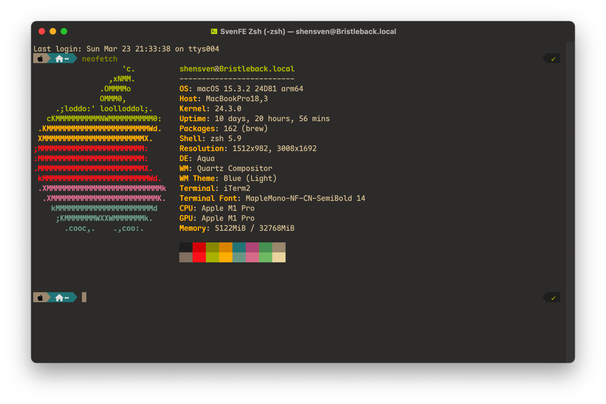
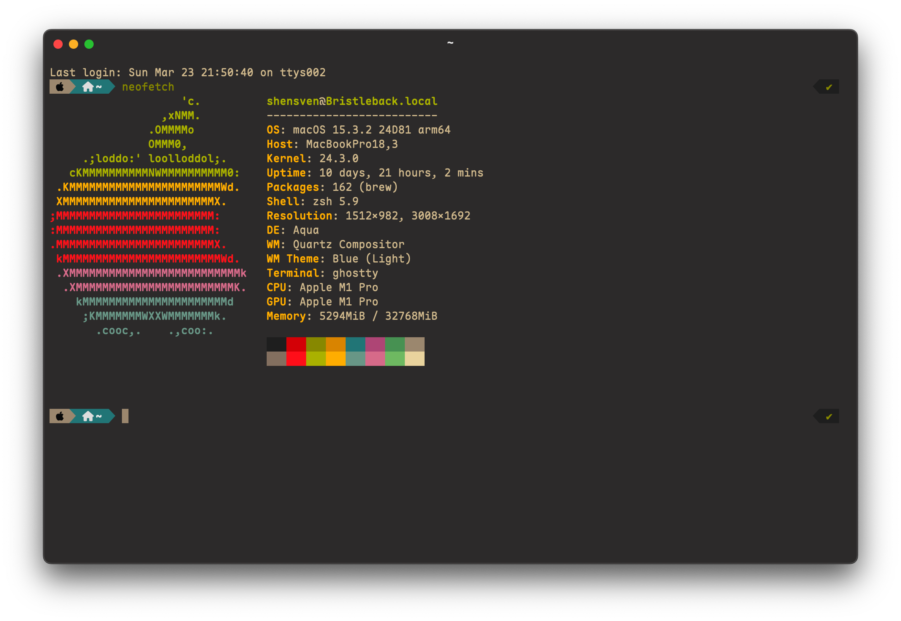
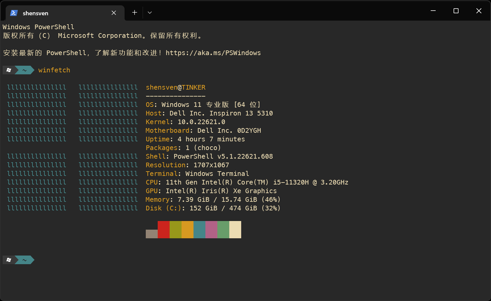

# Terminal Profile

```text
# etc/motd
 ________  ________  _______            ___    ___ ________  ___  ___          ________  ___  __
|\   __  \|\   __  \|\  ___ \          |\  \  /  /|\   __  \|\  \|\  \        |\   __  \|\  \|\  \
\ \  \|\  \ \  \|\  \ \   __/|         \ \  \/  / | \  \|\  \ \  \\\  \       \ \  \|\  \ \  \/  /|_
 \ \   __  \ \   _  _\ \  \_|/__        \ \    / / \ \  \\\  \ \  \\\  \       \ \  \\\  \ \   ___  \
  \ \  \ \  \ \  \\  \\ \  \_|\ \        \/  /  /   \ \  \\\  \ \  \\\  \       \ \  \\\  \ \  \\ \  \
   \ \__\ \__\ \__\\ _\\ \_______\     __/  / /      \ \_______\ \_______\       \ \_______\ \__\\ \__\
    \|__|\|__|\|__|\|__|\|_______|    |\___/ /        \|_______|\|_______|        \|_______|\|__| \|__|
                                      \|___|/
```

## macOS





<!-- ### Windows


 -->

## Recommended nerd fonts

### Maple Mono

- [Maple-Mono-NF-CN.zip](https://github.com/subframe7536/maple-font/releases/download/v7.0/MapleMono-NF-CN-unhinted.zip)

## Zsh Plugins

```sh
brew install zsh-autosuggestions
```

```sh
brew install zsh-syntax-highlighting
```
